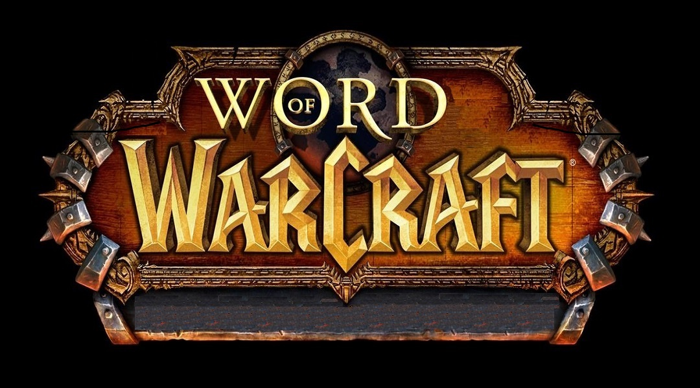
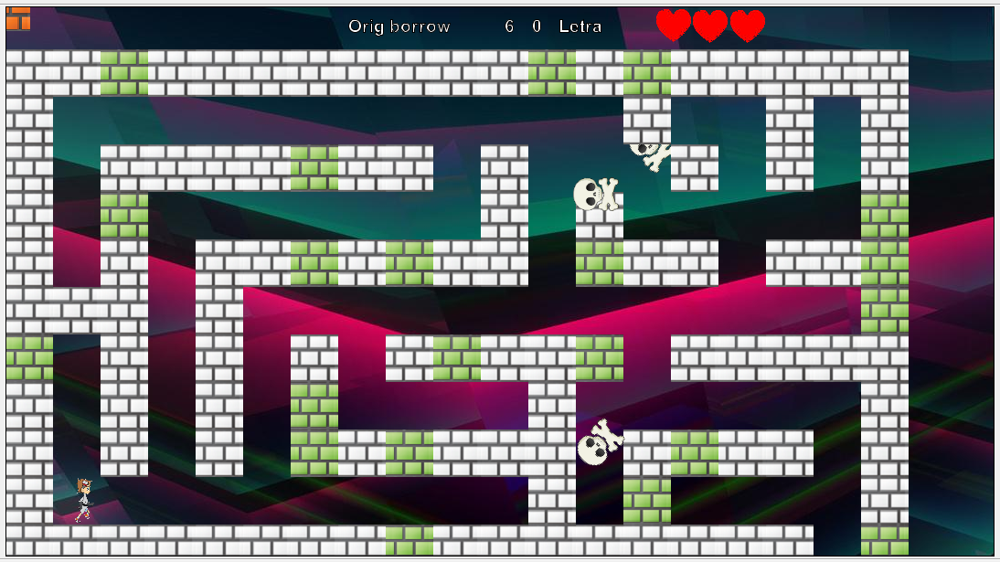

### Clases principales y sus características
1. Muro
    - MuroE
    - MuroN

2. Personaje
    - Jugador
    - Enemigo

3. Botón
    - Ayuda
    - Créditos 
    - Jugar
    
### Capturas de pantalla

### Diagrama de clases
[Diagrama #1](https://plus.google.com/photos/113828127959402830080/album/6425319837927158817/6425319837735476658?authkey=CNKUmsDv9faz9AE)

[Diagrama #2](https://plus.google.com/photos/113828127959402830080/album/6425319837927158817/6425319839099449426?authkey=CNKUmsDv9faz9AE)

### Link De descarga

[Descarga](https://github.com/anuma98/WordOfWarcaft/blob/master/WordOfWarcraftFinal.zip)

### Manual

[Manual Usuario](https://github.com/anuma98/WordOfWarcaft/blob/master/Manual%20de%20usuario.pdf)

### Autor(es)
El autor(es) del proyecto son:
- Néstor Javier Méndez Gutiérrez
- Antonio de Jesús Noyola Ruiz
### Vídeo
[Video Muestra](https://www.youtube.com/watch?v=i0rIihtdYG8)
### Materia(s)
- Programación Orientada a Objetos

### Semestre
- 2016-2017/II

### Universidad Autónoma de San Luis Potosí, 2017
